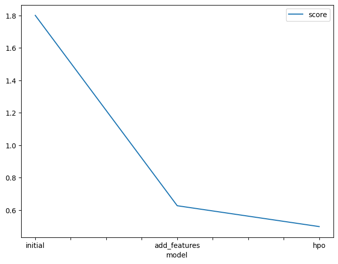

# Report: Predict Bike Sharing Demand with AutoGluon Solution
#### AKANKSHA JOSHI

## Initial Training
### What did you realize when you tried to submit your predictions? What changes were needed to the output of the predictor to submit your results?
TODO: Outputs from the predictor results in a Pandas Series object. To submit the predictions in the required datetime and count format, we create a series object named predictions and save the result of the predictions in submission dataframe which is finally saved as a .csv file for submission.

### What was the top ranked model that performed?
TODO: WeightedEnsemble_L3 is the top ranked model with the given parameters and evaluations on the trained data: score_val: -37.182771, pred_time_val: 1.733366, fit_time: 345.896416, pred_time_val_marginal: 0.000968, fit_time_marginal: 0.359208, stack_level: 3, and can_infer: True.

## Exploratory data analysis and feature creation
### What did the exploratory analysis find and how did you add additional features?
TODO: Exploratory analysis showed the distributions of each data feature of the dataset. Season and weathers are features which were encoded as categorical to determine the results more accurately. Datetime column is split into hour, day, and month features. Distribution for holiday is highly unbalanced whereas that of day, hour are right skewed. Count has a normal distribution.

### How much better did your model preform after adding additional features and why do you think that is?
TODO: After the addition of additional features and data wrangling methods, the kaggle score for submissions shooted up from the inital of 1.80114 to 00.62685. Adding additional features with different distributions affected the output as each one of the hour, day, and month features individually convey separate information regarding the count variable. Further, they have a significant effect in determining the output. Also, conversion of weather and season as categorical variable conveyed more information which would have been missed if they were regarded as integer type data.

## Hyper parameter tuning
### How much better did your model preform after trying different hyper parameters?
TODO: The model scored 0.62685 without the optimized hyperparameters, however after tuning it achieved a kaggle score of 0.49818 on the predictions.

### If you were given more time with this dataset, where do you think you would spend more time?
TODO: Feature engineering. As it is evident from the model scores, there was a drastic improvement in the model after feature engineering. If given more time with the dataset, I would normalize the dataset using standard scaler and encode the categorical variables using one hot encoding.

### Create a table with the models you ran, the hyperparameters modified, and the kaggle score.
|model|hpo1|hpo2|hpo3|score|
|--|--|--|--|--|
|initial_model|default_vals|default_vals|default_vals|1.80114|
|add_features_model|default_vals|default_vals|default_vals|00.62685|
|hpo_model|GBM: num_leaves: lower=26, upper=66|NN: dropout_prob: 0.0, 0.5|GBM: num_boost_round: 100	|0.49818|

### Create a line plot showing the top model score for the three (or more) training runs during the project.

TODO: Replace the image below with your own.

### Create a line plot showing the top kaggle score for the three (or more) prediction submissions during the project.

TODO: Replace the image below with your own.

## Summary
TODO: Predict bike sharing demand project model using WeightedEnsemble_L3 algorithm helps to achieve a score of 0.49818 on the prediction. 
